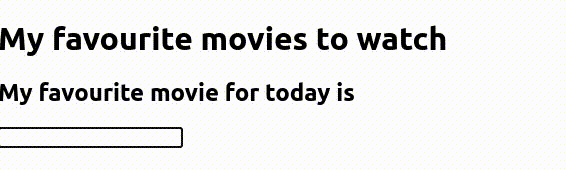
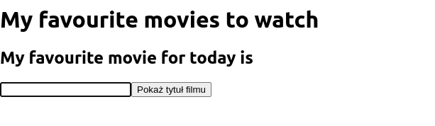

Co się stanie, jeśli w obsłudze zdarzenia zmienimy wartość zmiennej `title`?

```js
let title = 'Wall-E';

function handleChange(event) {
    title = event.target.value;
}
```

NIC :-) Czy nie byłoby pięknie, gdyby React _zareagował_ na zmianę tej wartości
i automatycznie zaktualizował widok użytkownika na podstawie posiadanych danych?
Czy nie mogłoby być tak, by React był _reaktywny_? :-) Oczywiście, że tak!
Musimy jedynie wskazać frameworkowi miejsca, w których przechowujemy stan komponentu,
na podstawie którego są one renderowane.

W tym celu użyjemy pierwszego _hooka_ Reactowego - `useState`.

```jsx
import {useState} from "react";

function App() {
    const [title, setTitle] = useState('Wall-E');

    function handleChange(event) {
        setTitle(event.target.value);
    }

// ...
```

Hook `useState` definiuje zmienną przechowującą stan komponentu. Argument, który przyjmuje
to wartość domyślna stanu (przy pierwszym renderowaniu komponentu). Zwraca on dwuelementową
tablicę, w której pierwszy element to zmienna z aktualnym stanem komponentu, a drugi to funkcja
pozwalająca ten stan zmienić tak, by React się o tym dowiedział i ponownie wyrenderował komponent.

Składnia `const [title, setTitle] = ...` to [_Destructuring
assignment_](https://developer.mozilla.org/en-US/docs/Web/JavaScript/Reference/Operators/Destructuring_assignment)
pozwalające na szybkie stworzenie zmiennych z kolejnych elementów w tablicy.

Jak się teraz zachowuje aplikacja?



Do pełni szczęścia brakuje jedynie wypełnienia pola tekstowego wartością
początkową. W tym celu podamy wartość do atrybutu `value` pochodzącą ze stanu
komponentu. Zwróć uwagę na użycie klamerek zamiast apostrofów przy definicji
atrybutu.

```jsx {hl_lines="12"}
function App() {
    const [title, setTitle] = useState('Wall-E');

    function handleChange(event) {
        setTitle(event.target.value);
    }

    return (
        <div>
            <h1>My favourite movies to watch</h1>
            <h2>My favourite movie for today is {title}</h2>
            <input type="text" value={title} onChange={handleChange}/>
        </div>
    );
}
```

### Jak to działa?

Każda zmiana stanu komponentu za pomocą dostarczonego przez `useState`
settera powoduje ponowne wyrednerowanie kopmonentu (ponowne wywołanie funkcji).
To spowoduje ponowne zawołanie `useState`, które w pierwszym elemencie tablicy zwróci
nowo ustawioną wartość, a zwrócony JSX wyrenderuje się ponownie dla nowych danych.

{}
Niezwykle istotne jest, by nigdy nie modyfikować stanu komponentu bezpośrednio
(np. poprzez przypisanie wartości do `title` w powyższym przypadku). Stan komponentu
należy modyfikować jedynie przy użyciu dostarczonego przez `useState` settera.
Stan komponentu z punktu widzenia funkcji renderującej jest _immutable_.
{}

Ten mechanizm nazywamy _reaktywnością_ i stąd też wzięła się nazwa frameworka.

### Warunki logiczne w szablonie

W jaki sposób wyrenderować jeden z konkretnych elementów? Spróbuj pokazać
użytkownikowi odpowiedni komunikat na podstawie długości wpisanego tytułu filmu.
Dodatkowo, nie pokazuj komunikatu w ogóle, jeśli tytuł nie jest wpisany.



{}

```js
let message;
if (title.length < 5) {
    message = <div>Tutuł jest za krótki. Nagrywają takie filmy?</div>;
} else if (title.length < 15) {
    message = <div>Tytuł jest ekstra, w sam raz na plakat przed kinem!</div>;
} else {
    message = <div>Tytuł jest za długi, nikt tego nie zapamięta.</div>;
}
// ...
{
    title.length > 0 && <div>{message}</div>
}
```

{}

{}
Zacommituj zmiany i wyślij je na GitHuba.
{}

{}
Za jeden z najdłuższych tytułów filmów uznaje
się [Night of the Day of the Dawn of the Son of the Bride of the Return of the Revenge of the Terror of the Attack of the Evil, Mutant, Alien, Flesh Eating, Hellbound, Zombified Living Dead Part 2: In Shocking 2-D](https://pl.wikipedia.org/wiki/Night_of_the_Day_of_the_Dawn_of_the_Son_of_the_Bride_of_the_Return_of_the_Revenge_of_the_Terror_of_the_Attack_of_the_Evil,_Mutant,_Alien,_Flesh_Eating,_Hellbound,_Zombified_Living_Dead_Part_2:_In_Shocking_2-D).
W recencjach często skracano go jako *NOTDOT*.
{}


