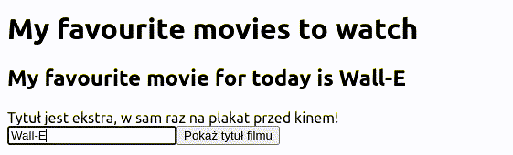

## Przyciski

Dodaj przycisk, który po kliknięciu wyświetli wpisany tytuł
za pomocą funkcji `alert`.



{}

```jsx
<button type="button" onClick={() => alert(title)}>
    Pokaż tytuł filmu
</button>
```

{}

{}
W języku Javascript istnieją dwa główne sposoby definicji funkcji.
Pierwszy, zaprezentowany wcześniej, to funkcje nazwane.

```js
function isEven(number) {
    return (number % 2) === 0;
}
```

Drugi sposób to skrócony zapis nazywany *funkcją strzałkową* (arrow function).

```js
(number) => (number % 2) === 0;
```

Po lewej stronie strzałki powinna znaleźć się sygnatura funckji (lista argumentów), a po prawej
rezultat zwracany w wyniku wywołania funkcji. Tak stworzoną funkcję możemy użyć *w miejscu*
gdzie jest potrzebna, bez konieczności nazywania jej.

Dla wtajemniczonych: tak, są jeszcze inne sposoby definicji funkcji, oraz subtelne różnice
pomiędzy ich działaniem, ale aspekt ten wykracza poza nasze zajęcia.

{}

{}
Zacommituj zmiany i wyślij je na GitHuba.
{}
