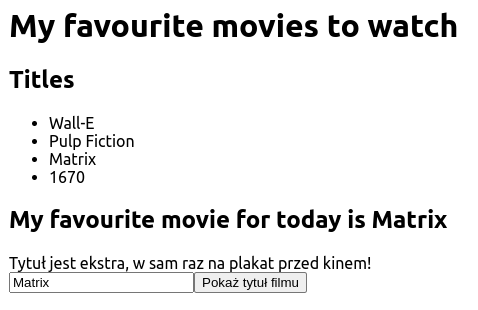

## Listy elementów

Aby wyświetlić użytkownikowi listę filmów, należy wygenerować dla każdego elementu
tablicy z filmami odpowiedni element HTML. Najczęściej w tym celu wykorzystuje się
metodę [`map`](https://developer.mozilla.org/en-US/docs/Web/JavaScript/Reference/Global_Objects/Array/map),
która służy do przekształcenia każdego elementu tablicy w coś innego, a właśnie tego potrzebujemy.

{}
Przykład żywcem zaczerpnięty z podlinkowanej dokumentacji:

```js
const array1 = [1, 4, 9, 16];

// Pass a function to map
const map1 = array1.map((x) => x * 2);

console.log(map1);
// Expected output: Array [2, 8, 18, 32]
```

{}

Załóżmy więc, że nasze filmy będą przechowywane jako tablica obiektów. Przygotowujemy się
już w ten sposób do tego, że filmy w naszej aplikacji będą opisywane nie tylko przy pomocy tytułu.

```js
const movies = [
    {title: "Wall-E"},
    {title: "Pulp Fiction"},
    {title: "Matrix"},
    {title: "1670"},
];
```

Aby wyświetlić na tej podstawie listę elementów HTML, należy przemapować obiekty z tablicy
na elementy do wyrenderowania w interfejsie użytkownika.

```jsx
<ul>
    {movies.map((movie) => <li key={movie.title}>{movie.title}</li>)}
</ul>
```

Zwróć uwagę na:

* atrybut `key`, który pozwala Reactowi na identyfikację z którego elementu tablicy został wyrenderowany dany fragment
* wykorzystanie metody `map` z tablicy
* przekazaną do niej funkcję strzałkową, która mapuje obiekt na element HTML

Wprowadź renderowanie listy filmów do Twojego komponentu.



{}
[Rendering Lists](https://react.dev/learn/rendering-lists)
{}

{}
Zacommituj zmiany i wyślij je na GitHuba.
{}
