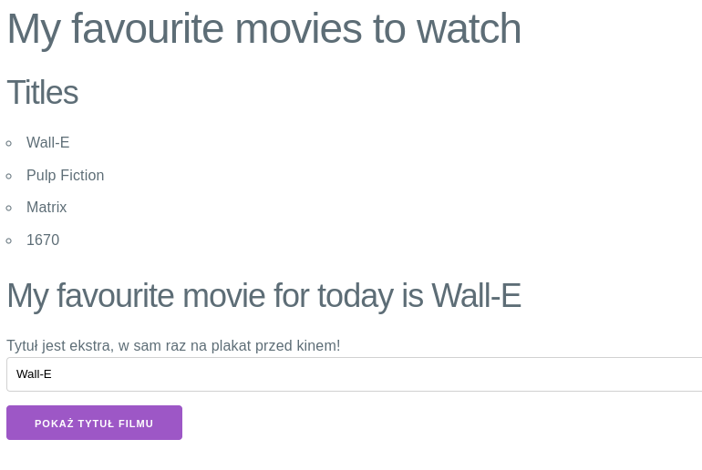

Większość z nas bez wsparcia od grafików nie potrafi stworzyć ładnego interfejsu
użytkownika. Na szczęście, możemy do projektu dodać różne biblioteki, które
dostarczają na tyle dobre style do aplikacji, że wygląda ona całkiem dobrze.

Dodajmy do projektu bardzo lekki, ale wystarczający do naszych zastosowań
framework [Milligram](https://milligram.io/). Po jego dodaniu nasza aplikacja
powinna zacząć *jakoś* wyglądać :)

Aby zainstalować nową bibliotekę w projekcie:

1. Zatrzymaj Twoją aplikację, jeśli jest uruchomiona.
1. Wykonaj komendę instalującą nową zależność `npm install milligram`.
1. Zauważ, że zależność została dodana do pliku `package.json`.
1. Zaimportuj bibliotekę w komponencie `src/App.js`
    ```jsx
    import "milligram";
    ```
1. Uruchom aplikację. Powinna wyglądać mniej więcej tak:

   

{}
Zacommituj zmiany i wyślij je na GitHuba.
{}
