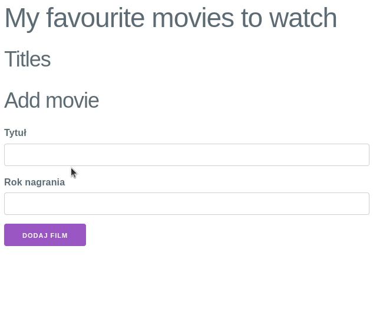

Czas na zebranie wszystkich poznanych informacji w pierwszą funkcjonalność w naszej aplikacji.



{}
Pamiętaj o konieczności zdefiniowania stanu komponentu, żeby React reagował na nowo dodawane filmy.

```js
const [movies, setMovies] = useState([]);
```

W przypadku tablic, jak w każdym innym stanie komponentu, przy modyfikacji stanu do funkcji
`setMovies` należy podać nową instancję tablicy. Nie możemy modyfikować bezpośrednio tablicy
poprzez dodanie do niej elementu.

W tym celu pomocny może okazać się operator *spread*.

```js
setMovies([...movies, newMovie]);
```

Więcej
informacji: [Spread in array literals](https://developer.mozilla.org/en-US/docs/Web/JavaScript/Reference/Operators/Spread_syntax#spread_in_array_literals)
{}

{}
Zacommituj zmiany i wyślij je na GitHuba.
{}
