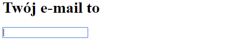
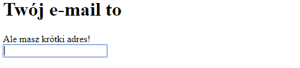

Co się stanie, jeśli w obsłudze zdarzenia zmienimy wartość zmiennej `email`?

```js
let email = 'fracz@agh.edu.pl';

function handleChange(event) {
    email = event.target.value;
}
```

NIC :-) Czy nie byłoby pięknie, gdyby React _zareagował_ na zmianę tej wartości
i automatycznie zaktualizował widok użytkownika na podstawie posiadanych danych?
Czy nie mogłoby być tak, by React był _reaktywny_? :-) Oczywiście, że tak!
Musimy jedynie wskazać frameworkowi miejsca, w których przechowujemy stan komponentu,
na podstawie którego są one renderowane.

W tym celu użyjemy pierwszego _hooka_ Reactowego - `useState`.

```jsx
import {useState} from "react";

function App() {
    const [email, setEmail] = useState('fracz@agh.edu.pl');

    function handleChange(event) {
        setEmail(event.target.value);
    }

// ...
```

Hook `useState` definiuje zmienną przechowującą stan komponentu. Argument, który przyjmuje
to wartość domyślna stanu (przy pierwszym renderowaniu komponentu). Zwraca on dwuelementową
tablicę, w której pierwszy element to zmienna z aktualnym stanem komponentu, a drugi to funkcja
pozwalająca ten stan zmienić tak, by React się o tym dowiedział i ponownie wyrenderował komponent.

Składnia `const [email, setEmail] = ...` to [_Destructuring
assignment_](https://developer.mozilla.org/en-US/docs/Web/JavaScript/Reference/Operators/Destructuring_assignment)
pozwalające na szybkie stworzenie zmiennych z kolejnych elementów w tablicy.

Jak się teraz zachowuje aplikacja?



Do pełni szczęścia brakuje jedynie wypełnienia pola tekstowego wartością
początkową. W tym celu podamy wartość do atrybutu `value` pochodzącą ze stanu
komponentu. Zwróć uwagę na użycie klamerek zamiast apostrofów przy definicji
atrybutu.

```jsx
function App() {
    const [email, setEmail] = useState('fracz@agh.edu.pl');

    function handleChange(event) {
        setEmail(event.target.value);
    }

    return (
        <div>
            <h1>System do zapisów na zajęcia</h1>
            <h2>Twój e-mail to {email}</h2>
            <input type="text" value={email} onChange={handleChange}/>
        </div>
    );
}
```

### Jak to działa?

Każda zmiana stanu komponentu za pomocą dostarczonego przez `useState`
settera powoduje ponowne wyrednerowanie kopmonentu (ponowne wywołanie funkcji).
To spowoduje ponowne zawołanie `useState`, które w pierwszym elemencie tablicy zwróci
nowo ustawioną wartość, a zwrócony JSX wyrenderuje się ponownie dla nowych danych.

{}
Niezwykle istotne jest, by nigdy nie modyfikować stanu komponentu bezpośrednio
(np. poprzez przypisanie wartości do `email` w powyższym przypadku). Stan komponentu
należy modyfikować jedynie przy użyciu dostarczonego przez `useState` settera.
Stan komponentu z punktu widzenia funkcji renderującej jest _immutable_.
{}

Ten mechanizm nazywamy _reaktywnością_ i stąd też wzięła się nazwa frameworka.

### Warunki logiczne w szablonie

W jaki sposób wyrenderować jeden z konkretnych elementów? Spróbuj pokazać
użytkownikowi odpowiedni komunikat na podstawie długości jego adresu e-mail.



{}

```js
let message;
if (email.length < 10) {
    message = <div>Ale masz krótki adres!</div>;
} else if (email.length < 15) {
    message = <div>Twój adres e-mail jest w sam raz.</div>;
} else {
    message = <div>Twój adres e-mail jest stanowczo za długi.</div>;
}
```

{}
