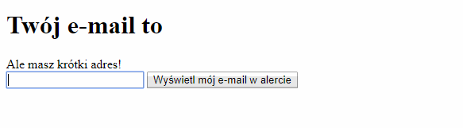
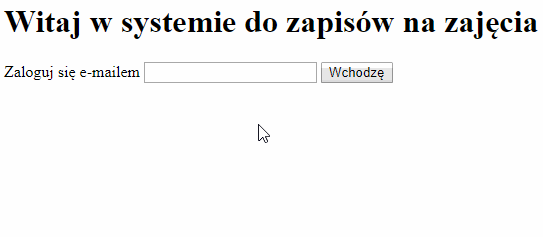

## Przyciski

Dodaj przycisk, który po kliknięciu wyświetli wpisany adres mailowy
za pomocą funkcji `alert`.



{}

```jsx
<button type="button" onClick={() => alert(email)}>Wyświetl mój e-mail w alercie</button>
```

{}

## Proste logowanie

Wykorzystaj wszystkie poznane informacje i wykonaj stronę wejściową do naszej aplikacji.



{}
Zacommituj zmiany i wyślij je na GitHuba.
{}
