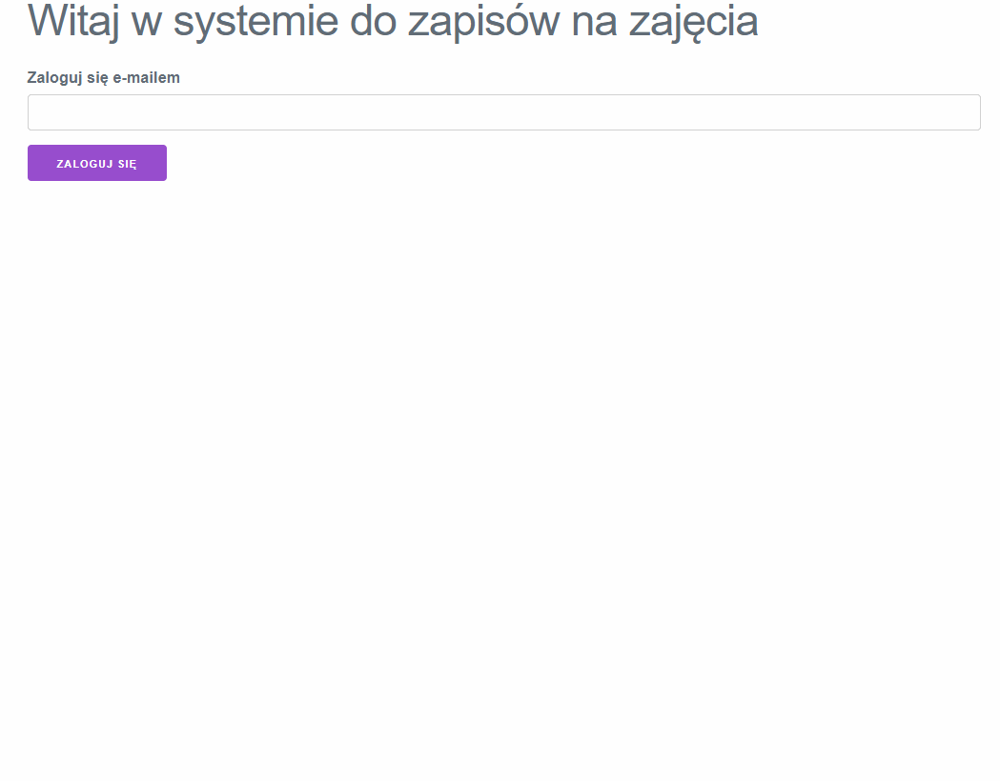

Poniżej znajdziesz kod dla podstawowych komponentów obsługujących spotkania w naszej
aplikacji.

### Formularz dodawania spotkań

`src/meetings/NewMeetingForm.js`

```jsx {hl_lines="8,13"}
import {useState} from "react";

export default function NewMeetingForm({onSubmit}) {
    const [title, setTitle] = useState('');
    const [description, setDescription] = useState('');

    function submit(event) {
        event.preventDefault();
        onSubmit({name, description});
    }

    return (
        <form onSubmit={submit}>
            <h3>Dodaj nowe spotkanie</h3>
            <label>Nazwa</label>
            <input type="text" value={title}
                   onChange={(e) => setTitle(e.target.value)}/>
            <label>Opis</label>
            <textarea value={description}
                      onChange={(e) => setDescription(e.target.value)}></textarea>
            <button>Dodaj</button>
        </form>
    );
}
```

Na uwagę zasługuje obsłużenie zdarzenia `onSubmit` na formularzu, dzięki
czemu będzie działać zatwierdzanie wpisanych danych za pomocą klawisza
<kbd>Enter</kbd> w polu z nazwą. Kod `event.preventDefault()` anuluje
domyślne zachowanie przeglądarki, które odświeżałoby stronę przy zatwierdzaniu
formularza.

### Wyświetlanie listy spotkań

`src/meetings/MeetingsList.js`

```jsx {hl_lines="12"}
export default function MeetingsList({meetings}) {
    return (
        <table>
            <thead>
            <tr>
                <th>Nazwa spotkania</th>
                <th>Opis</th>
            </tr>
            </thead>
            <tbody>
            {
                meetings.map((meeting, index) => <tr key={index}>
                    <td>{meeting.name}</td>
                    <td>{meeting.description}</td>
                </tr>)
            }
            </tbody>
        </table>
    );
}
```

Komponent odbiera listę spotkań do wyświetlenia w _propsach_. Zwróć uwagę
jak wykorzystano metodę `map` tablicy, by przekształcić każde spotkanie z tablicy
w wiersz tabeli w JSX. Każdy wygenerowany w ten sposób element musi otrzymać
swój klucz `key`, który pozwoli na identyfikację elementu przez framework.
W tym przypadku używamy po prostu jego indeksu w tablicy.

### Strona spotkań

`src/meetings/MeetingsPage.js`

{}

```jsx {hl_lines="9"}
import {useState} from "react";
import NewMeetingForm from "./NewMeetingForm";
import MeetingsList from "./MeetingsList";

export default function MeetingsPage() {
    const [meetings, setMeetings] = useState([]);

    function handleNewMeeting(meeting) {
        const nextMeetings = [...meetings, meeting];
        setMeetings(nextMeetings);
    }

    return (
        <div>
            <h2>Zajęcia ({meetings.length})</h2>
            <NewMeetingForm onSubmit={(meeting) => handleNewMeeting(meeting)}/>
            <MeetingsList meetings={meetings}/>
        </div>
    )
}
```

{}

Tutaj z kolei na uwagę zasługuje sposób dodania do stanu będącego tablicą
nowego spotkania. Zauważ, że nie wykorzystujemy tutaj metody `push`,
ponieważ stan komponentu jest niemutowalny! Zamiast tego tworzymy nową
tablicę zawierającą wszystkie elementy z poprzedniego stanu plus
nowe spotkanie, a następnie przekazujemy ją jako wartość do `setMeetings`.
Tablica jest budowana z
użyciem [spread syntax](https://developer.mozilla.org/en-US/docs/Web/JavaScript/Reference/Operators/Spread_syntax).

## Oczekiwane zachowanie aplikacji po tych krokach



{}
Zacommituj zmiany i wyślij je na GitHuba.
{}
